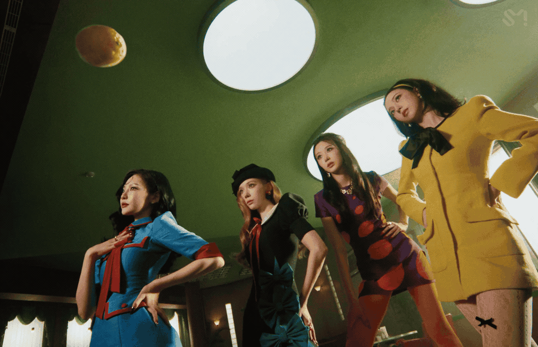
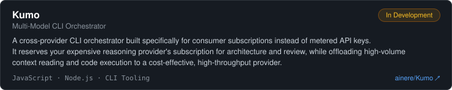
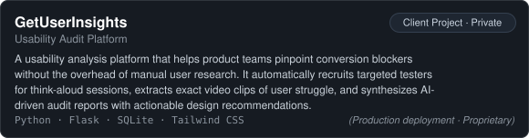
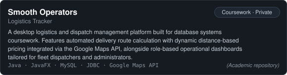

<div align="center">



<sub>now playing: aespa - lemonade ♫</sub>

</div>

---

<div align="center">



</div>

---

<h2 align="center"> about</h2>

<div align="left">

```ini
[System_Config]
User          = Kan
Affiliation   = De La Salle University
Progression   = BS Computer Science major in Software Technology
Status        = Building practical applications & figuring out what GPUs do underneath all those layers
ActiveBuild   = Kumo (multi-model consumer CLI orchestrator)
PlaybackQueue = aespa, Hearts2Hearts, ILLIT
Consumables   = Pink drink with strawberry açaí
Inventory     = Photocards & Pop Mart figures
IdleMode      = Gaming or hibernating
```

</div>

---

<h2 align="center"> projects</h2>

<div align="center">



<br />



<br />



</div>

---

<h2 align="center"> toolbox</h2>

<div align="center">



</div>

---

<h2 align="center"> connect</h2>

<div align="center">

[](mailto:lamadrid_ea@yahoo.com)
&nbsp;
[](https://www.linkedin.com/in/elkanlamadrid/)
&nbsp;
[](https://github.com/ainere)

<br><br>

<sub><code>You may now safely close this terminal.</code></sub>

</div>